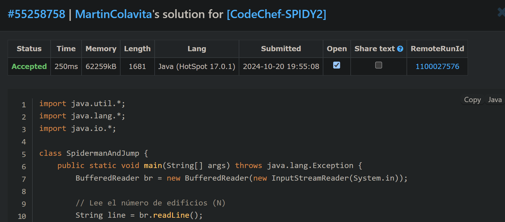

# Spiderman and Jumping

**Autor**: Martín Colavita  
**Legajo**: 12638/2

## Descripción
Este ejercicio implementa una solución utilizando programación dinámica en **Java 11**. 
El problema se basa en ayudar a Spiderman a saltar entre edificios y alcanzar el último edificio (N) con el mínimo costo de energía. Los saltos permitidos entre edificios son aquellos donde la diferencia entre los números de edificio es una potencia de 2 (1, 2, 4, etc.), y el costo de un salto es la diferencia absoluta de alturas entre los edificios.
El enfoque utilizado  para resolver el problema  es bottom-up.

---

## Índice
1. [Enunciado](#enunciado)
   - [Enunciado en español](#enunciado-en-español)
   - [Enunciado en inglés](#enunciado-en-inglés)
2. [Resolución del ejercicio](#resolución-del-ejercicio)
   - [Captura de resultados](#captura-de-resultados)
   - [Link al ejercicio en el juez](#link-al-ejercicio-en-el-juez)

---

## Enunciado

### Enunciado en español

N edificios están construidos en una fila, numerados del 1 al N de izquierda a derecha. Spiderman está en el edificio número 1 y quiere llegar al edificio número N. Puede saltar del edificio i al edificio j si y solo si i < j y j - i es una potencia de 2 (1, 2, 4, etc.). Cada salto le cuesta una energía igual a |Altura[j] - Altura[i]|, donde Altura[i] es la altura del edificio i. Encuentra la cantidad mínima de energía que Spiderman necesita para llegar al edificio N.

#### Entrada
- La primera línea contiene el número de edificios N.
- La siguiente línea contiene N enteros separados por espacios, que representan las alturas de los edificios.

#### Salida
- Imprime un único número entero, que es la cantidad mínima de energía necesaria para llegar al edificio N.

### Ejemplo de Entrada
```
4
1 2 3 4
```

### Ejemplo de Salida
```
3
```

---

### Enunciado en inglés

N buildings are built in a row, numbered 1 to N from left to right. Spiderman is on building number 1, and wants to reach building number N. He can jump from building number i to building number j iff i < j and j - i is a power of 2 (1, 2, 4, so on). Such a move costs him energy |Height[j] - Height[i]|, where Height[i] is the height of the ith building. Find the minimum energy using which he can reach building N.

#### Input
- The first line contains the number of buildings N.
- The next line contains N space-separated integers, denoting the heights of the buildings.

#### Output
- Print a single integer, the minimum energy required to reach building N.

### Sample Input
```
4
1 2 3 4
```

### Sample Output
```
3
```


---

### Captura de resultados


### Link al ejercicio en el juez
- **Enlace del ejercicio**: https://vjudge.net/problem/CodeChef-SPIDY2

