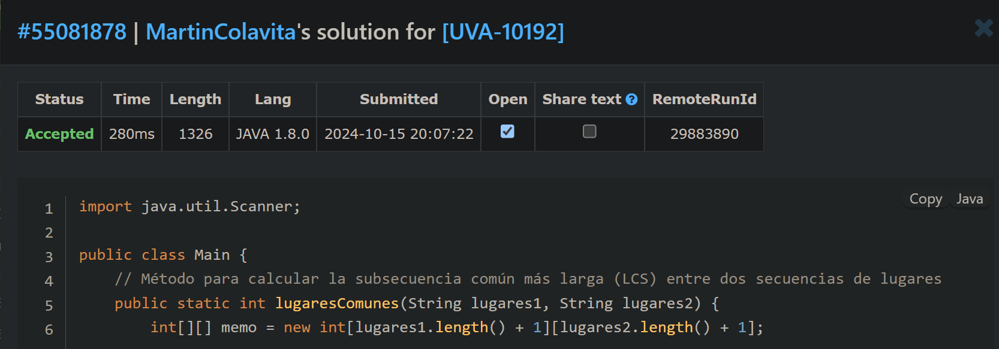

# Vacation Planning Problem

**Autor**: Martín Colavita  
**Legajo**: 12638/2

## Descripción
Este ejercicio resuelve el problema "Vacation Planning Problem", en el cual se busca encontrar la mayor cantidad de ciudades que pueden visitarse, en el orden sugerido por ambos padres, utilizando la programación dinámica. La solución fue implementada en **Java 1.8** debido a las limitaciones de versión del juez en línea.

**NOTA**:
>  LOS NOMBRES DE LOS ARCHIVOS SON DISTINTOS AL NOMBRE DE LA CLASE PARA EVITAR ERRORES DE COMPILACIÓN EN EL TEST.


----------------------------------------------------------------------------------------------------------------------------

## Índice

1. [Enunciado](#enunciado)
   - [Enunciado en español](#enunciado-en-español)
   - [Enunciado en inglés](#enunciado-en-inglés)
2. [Resolución del ejercicio](#resolución-del-ejercicio)
   - [Captura de resultados](#captura-de-resultados)
   - [Link al ejercicio en el juez](#link-al-ejercicio-en-el-juez)

----------------------------------------------------------------------------------------------------------------------------

## Enunciado

### Enunciado en español

```md
# Problema de Planificación de Vacaciones

Estás planeando tomarte un descanso y salir de vacaciones, pero realmente no sabes qué ciudades debes visitar. Entonces, pides ayuda a tus padres. Tu madre dice: "Hijo, DEBES visitar París, Madrid, Lisboa y Londres. Pero solo es divertido en este orden". Luego, tu padre dice: "Hijo, si planeas viajar, ve primero a París, luego a Lisboa, luego a Londres y finalmente, al final, ve a Madrid. Sé de lo que hablo."

Ahora estás un poco confundido, ya que no esperabas esta situación. Temes herir a tu madre si sigues la sugerencia de tu padre. Pero también temes herir a tu padre si sigues la sugerencia de tu madre. ¡Y la situación puede empeorar, porque podrías herir a ambos si simplemente ignoras sus sugerencias!

Por lo tanto, decides que intentarás seguir sus sugerencias de la mejor manera que puedas. Te das cuenta de que el orden “París-Lisboa-Londres” es el que mejor satisface tanto a tu madre como a tu padre. Después puedes decir que no pudiste visitar Madrid, aunque te hubiera gustado mucho.

Si tu padre hubiera sugerido el orden “Londres-París-Lisboa-Madrid”, entonces tendrías dos órdenes, “París-Lisboa” y “París-Madrid”, que mejor satisfarían las sugerencias de ambos padres. En este caso, solo podrías visitar 2 ciudades.

Quieres evitar problemas como este en el futuro. ¿Y si las sugerencias de viaje fueran más grandes? Probablemente no encontrarías la mejor manera tan fácilmente. Entonces, decidiste escribir un programa para ayudarte con esta tarea.

### Entrada
La entrada consistirá en un número arbitrario de pares de secuencias de ciudades. La entrada termina cuando la primera secuencia comienza con el carácter ‘#’ (sin las comillas). Tu programa no debe procesar este caso. Cada secuencia de viaje estará en una línea sola y se formará con caracteres válidos (como se define anteriormente). Todas las secuencias de viaje aparecerán en una sola línea y tendrán un máximo de 100 ciudades.

### Salida
Para cada par de secuencias, debes imprimir el siguiente mensaje en una línea sola:
```
Caso #d: puedes visitar como máximo K ciudades.
```
Donde `d` representa el número del caso de prueba (comenzando desde 1) y `K` es el número máximo de ciudades que puedes visitar, de modo que satisfagas tanto la sugerencia de tu padre como la de tu madre.

### Ejemplo de Entrada
```
abcd
acdb
abcd
dacb
#
```

### Ejemplo de Salida
```
Caso #1: puedes visitar como máximo 3 ciudades.
Caso #2: puedes visitar como máximo 2 ciudades.
```
```
--- 
### Enunciado en inglés

```md
# Vacation Planning Problem

You are planning to take some rest and to go out on vacation, but you really don’t know which cities you should visit. So, you ask your parents for help. Your mother says, "My son, you MUST visit Paris, Madrid, Lisboa, and London. But it’s only fun in this order." Then your father says: "Son, if you’re planning to travel, go first to Paris, then to Lisboa, then to London and then, at last, go to Madrid. I know what I’m talking about."

Now you’re a bit confused, as you didn’t expect this situation. You’re afraid that you’ll hurt your mother if you follow your father’s suggestion. But you’re also afraid to hurt your father if you follow your mother’s suggestion. It can get worse because you could hurt both of them if you simply ignore their suggestions!

Thus, you decide that you’ll try to follow their suggestions in the best way you can. You realize that the “Paris-Lisboa-London” order is the one which better satisfies both your mother and your father. Afterwards, you can say that you could not visit Madrid, even though you would’ve liked it very much.

If your father had suggested the “London-Paris-Lisboa-Madrid” order, then you would have two orders, “Paris-Lisboa” and “Paris-Madrid,” that would better satisfy both of your parents' suggestions. In this case, you could only visit 2 cities.

You want to avoid problems like this one in the future. What if their travel suggestions were bigger? Probably you would not find the best way very easily. So, you decided to write a program to help you in this task.

### Input
The input consists of an arbitrary number of city sequence pairs. The end of input occurs when the first sequence starts with a '#' character (without the quotes). Your program should not process this case. Each travel sequence will be on a line alone and will be formed by legal characters (as defined above). All travel sequences will appear in a single line and will have at most 100 cities.

### Output
For each sequence pair, you must print the following message in a line alone:
```
Case #d: you can visit at most K cities.
```
Where `d` stands for the test case number (starting from 1), and `K` is the maximum number of cities you can visit such that you’ll satisfy both your father’s suggestion and your mother’s suggestion.

### Sample Input
```
abcd
acdb
abcd
dacb
#
```

### Sample Output
```
Case #1: you can visit at most 3 cities.
Case #2: you can visit at most 2 cities.
```
```

----------------------------------------------------------------------------------------------------------------------------

### Captura de resultados



### Link al ejercicio en el juez
- **Enlace del ejercicio**:  [UVA-10192](https://vjudge.net/problem/UVA-10192)


