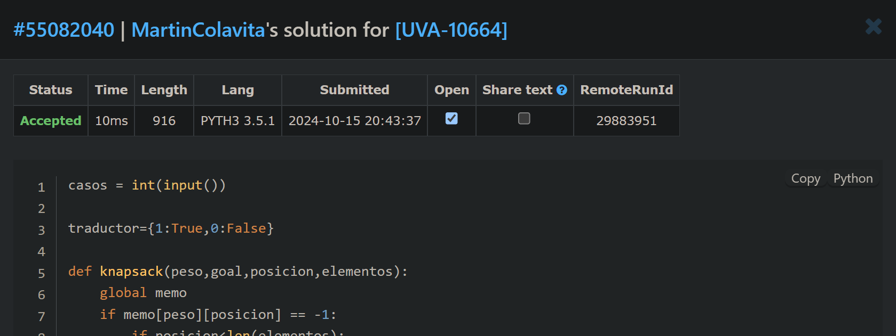

# Distribución de Maletas (Problema Knapsack)

**Autor**: Martín Colavita  
**Legajo**: 12638/2  

## Descripción
Este ejercicio implementa una solución utilizando programación dinámica en Python 3.5.1, ya que es la única opción permitida por el juez en línea. El problema se basa en distribuir un conjunto de maletas en dos baúles de coche de forma equitativa, determinando si es posible que ambos baúles tengan el mismo peso total de maletas.

---

## Índice
1. [Enunciado](#enunciado)
   - [Enunciado en español](#enunciado-en-español)
   - [Enunciado en inglés](#enunciado-en-inglés)
2. [Resolución del ejercicio](#resolución-del-ejercicio)
    - [Captura de resultados](#captura-de-resultados)
    - [Link al ejercicio en el juez](#link-al-ejercicio-en-el-juez)

---

## Enunciado

### Enunciado en español

Peter y sus amigos están de vacaciones, por lo que han decidido hacer un viaje en coche para conocer el norte de España. Son siete personas y creen que dos coches son suficientes para su equipaje.  
Es hora de partir... y hay una pila de maletas esperando fuera de los coches. Los conductores no se ponen de acuerdo sobre qué maletas deben ponerse en cada maletero, porque nadie quiere que un maletero lleve más peso que el otro. ¿Es posible que los dos maleteros carguen el mismo peso? (Obviamente, sin desempacar las maletas).

Considera **m** conjuntos de números que representan los pesos de las maletas, y debes decidir para cada uno de ellos si es posible distribuir las maletas en los maleteros, de modo que los dos maleteros pesen lo mismo.

### Entrada
- La primera línea de la entrada contiene un número entero **m**, que indica la cantidad de casos de prueba.
- Para cada caso de prueba, hay una línea que contiene **n** enteros separados por espacios (1 ≤ **n** ≤ 20). Estos enteros son los pesos de cada maleta. La suma total de los pesos de todas las maletas es menor o igual a 200 kilogramos.

### Salida
- La salida consiste en **m** líneas. La i-ésima línea corresponde al i-ésimo conjunto de pesos de maletas y contiene la cadena 'YES' o 'NO', dependiendo de si es posible que los dos maleteros carguen con el mismo peso para el caso de prueba correspondiente.

### Ejemplo de Entrada
```
3
1 2 1 2 1
2 3 4 1 2 5 10 50 3 50
3 5 2 7 1 7 5 2 8 9 1 25 15 8 3 1 38 45 8 1
```

### Ejemplo de Salida
```
NO
YES
YES
```

---

### Enunciado en inglés

Peter and his friends are on holiday, so they have decided to make a trip by car to know the north of Spain. They are seven people, and they think that two cars are enough for their luggage.  
It’s time to leave, and a heap of suitcases are awaiting outside the cars. The drivers disagree about which suitcase must be put into each boot because nobody wants one boot to carry more weight than the other one. Is it possible that the two boots load with the same weight? (Obviously without unpacking the suitcases!).

Consider **m** sets of numbers representing suitcase weights, and you must decide for each one if it is possible to distribute the suitcases into the boots so that the two boots weigh the same.

### Input
- The first line of the input contains an integer **m**, indicating the number of test cases.
- For each test case, there is a line containing **n** integers (1 ≤ **n** ≤ 20) separated by single spaces. These integers are the weights of each suitcase. The total sum of the weights of all the suitcases is less than or equal to 200 kilograms.

### Output
- The output consists of **m** lines. The i-th line corresponds to the i-th set of suitcases weight and contains the string 'YES' or 'NO', depending on the possibility that the two boots load with the same weight for the respective test case.

### Sample Input
```
3
1 2 1 2 1
2 3 4 1 2 5 10 50 3 50
3 5 2 7 1 7 5 2 8 9 1 25 15 8 3 1 38 45 8 1
```

### Sample Output
```
NO
YES
YES
```

---

### Captura de resultados


### Link al ejercicio en el juez
- **Enlace del ejercicio**: [VJudge - Problem UVA-10664](https://vjudge.net/problem/UVA-10664)


