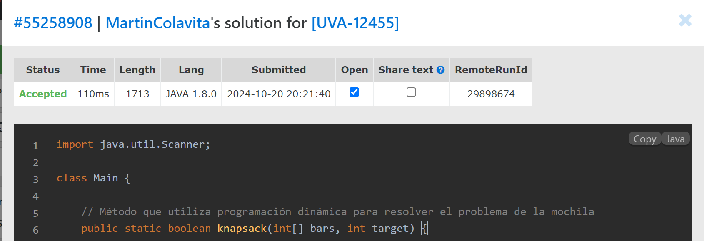

# Bars

**Autor**: Martín Colavita  
**Legajo**: 12638/2

## Descripción
Este ejercicio resuelve un problema de combinación de barras metálicas utilizando programación dinámica en Java 1.8.0. 
El objetivo es determinar si es posible formar una barra de una longitud exacta sin cortar ninguna barra, aplicando el algoritmo del "problema de la mochila" con una tabla `dp`.

**NOTA**:
>  LOS NOMBRES DE LOS ARCHIVOS SON DISTINTOS AL NOMBRE DE LA CLASE PARA EVITAR ERRORES DE COMPILACIÓN EN EL TEST.

---

## Índice
1. [Enunciado](#enunciado)
    - [Enunciado en español](#enunciado-en-español)
    - [Enunciado en inglés](#enunciado-en-inglés)
2. [Resolución del ejercicio](#resolución-del-ejercicio)
    - [Captura de resultados](#captura-de-resultados)
    - [Link al ejercicio en el juez](#link-al-ejercicio-en-el-juez)

---

## Enunciado

### Enunciado en español

Algunas cosas crecen si las juntas. Tenemos algunas barras metálicas, cuyas longitudes son conocidas, y si es necesario, queremos soldar algunas de ellas para obtener una barra exactamente de una longitud dada. Ninguna barra puede ser cortada. ¿Es posible hacerlo?

### Entrada
- La primera línea de la entrada contiene un número entero, **t**, 0 ≤ t ≤ 50, que indica el número de casos de prueba.
- Para cada caso de prueba, se presentan tres líneas:
    - La primera línea contiene un número **n**, 0 ≤ n ≤ 1000, que representa la longitud de la barra que queremos obtener.
    - La segunda línea contiene un número **p**, 1 ≤ p ≤ 20, que indica la cantidad de barras que tenemos.
    - La tercera línea contiene **p** números, que representan las longitudes de las **p** barras.

### Salida
Para cada caso de prueba, la salida debe ser una sola línea con la cadena "YES" si es posible formar la barra con las longitudes dadas, o "NO" en caso contrario.

### Ejemplo de Entrada
```
4
25
4
10 12 5 7
925
10
45 15 120 500 235 58 6 12 175 70
120
5
25 25 25 25 25
0
2
13 567
```

### Ejemplo de Salida
```
NO
YES
NO
YES
```

---

### Enunciado en inglés

Some things grow if you put them together. We have some metallic bars, their lengths are known, and if necessary, we want to solder some of them to obtain another one of a given length. No bar can be cut. Is it possible?

### Input
- The first line of input contains an integer, **t**, 0 ≤ t ≤ 50, indicating the number of test cases.
- For each test case, three lines appear:
    - The first line contains a number **n**, 0 ≤ n ≤ 1000, representing the length of the bar we want to obtain.
    - The second line contains a number **p**, 1 ≤ p ≤ 20, representing the number of bars we have.
    - The third line contains **p** numbers, representing the length of the **p** bars.

### Output
For each test case, the output should contain a single line, consisting of the string "YES" if it's possible to form the bar using the given lengths, or "NO" otherwise.

### Sample Input
```
4
25
4
10 12 5 7
925
10
45 15 120 500 235 58 6 12 175 70
120
5
25 25 25 25 25
0
2
13 567
```

### Sample Output
```
NO
YES
NO
YES
```

---

### Captura de resultados


### Link al ejercicio en el juez
- **Enlace del ejercicio**: [VJudge - Problem UVA-12455](https://vjudge.net/problem/UVA-12455)


